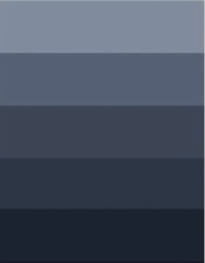
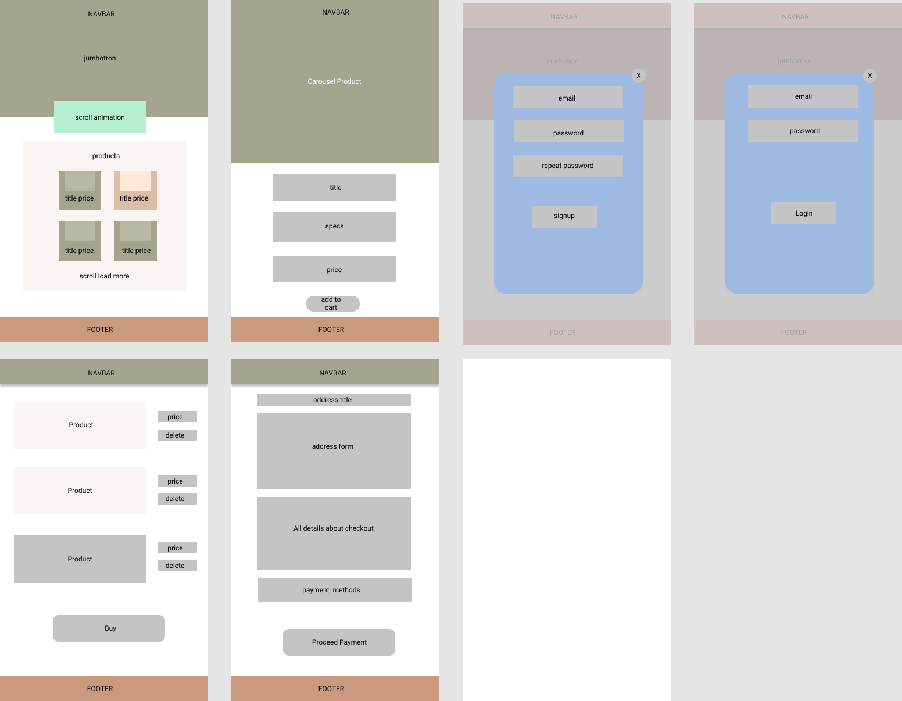
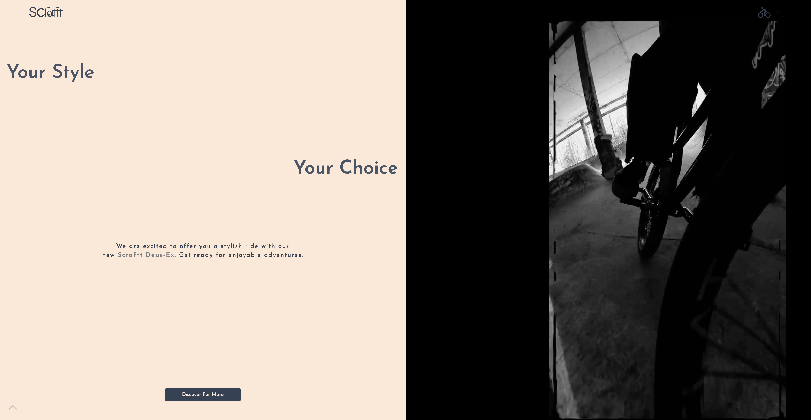
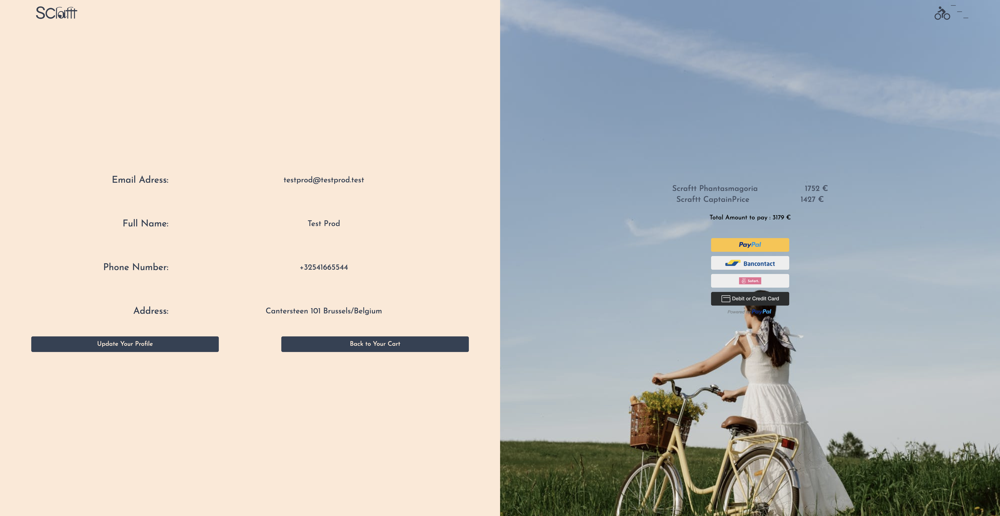

### SCrafttBicycles
[https://scrafttbicycles.netlify.app/](https://scrafttbicycles.netlify.app/)

This project is gonna be an e-commerce website for a local bussiness. This website is about a bussiness which is handcrafting bikes for different variety. Fully responsive for all kind of devices. 

#### Specifications
Signup, Login, Autenticated Routes, Paypal Payments Integration, Shopping Cart and Favorites Sections. 
Password Recovery with email.

---------

#### Color Palette 

--------
#### Mock8p9

---------
#### Tech 

React v.17.0.2  
React-Router v.6.2.1 
Tailwind v.3.0.15  
Firebase v.9.6.3  
React-Spring v.9.4.2  
HeadlessUI v.1.4.3  
Scroll-Snap v.4.0.2  
React-Leaflet v.3.2.5  
Slick-carousel v.1.8.1  

#### Deployment 

Netlify 

[https://scrafttbicycles.netlify.app/](https://scrafttbicycles.netlify.app/)

#### Examples 

